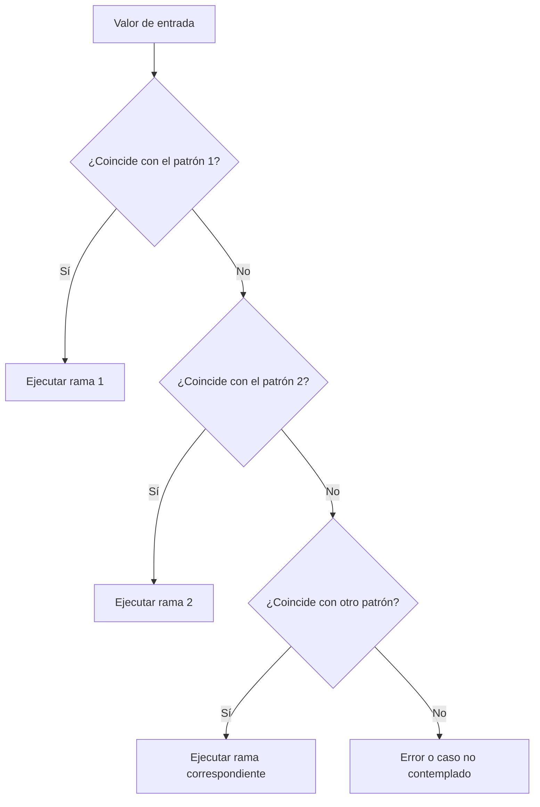

# Datos del estudiante

| Campo | Información |
|---|---|
| **Nombre completo** | Gael Nolasco Ayala |
| **Número de control** | 23212031 |
| **Carrera** | Ingeniería en Sistemas Computacionales |
| **Grupo** | SC7C |
| **Materia** | Programación Lógica y Funcional |
| **Profesor** | Rene Solis Reyes |
| **Tema** | Pattern matching (coincidencia de patrones): una introducción |

# Pattern matching (coincidencia de patrones): una introducción

<p align="center">
  
  
</p>

<p align="center"><em>Una técnica declarativa para reconocer la forma de los datos, extraer información y elegir un comportamiento.</em></p>

## Tabla de contenidos

- [1. Introducción](#1-introducción)
- [2. ¿Qué es el pattern matching?](#2-qué-es-el-pattern-matching)
- [3. ¿Cómo funciona?](#3-cómo-funciona)
- [4. Tipos de patrones](#4-tipos-de-patrones)
- [5. Ejemplos en lenguajes funcionales](#5-ejemplos-en-lenguajes-funcionales)
- [6. Ventajas y limitaciones](#6-ventajas-y-limitaciones)
- [7. Comparación con if y switch](#7-comparación-con-if-y-switch)
- [8. Aplicaciones prácticas](#8-aplicaciones-prácticas)
- [9. Conclusiones](#9-conclusiones)
- [10. Bibliografía](#10-bibliografía)

## 1. Introducción

La **coincidencia de patrones**, conocida en inglés como *pattern matching*, es una técnica utilizada en diversos lenguajes de programación para comparar un valor con una estructura o forma determinada. Cuando existe una coincidencia, el programa puede ejecutar una acción específica y, al mismo tiempo, extraer información del valor analizado.

A diferencia de una comparación simple, la coincidencia de patrones permite revisar la estructura interna de los datos. Por ejemplo, puede identificar si una lista está vacía, separar el primer elemento del resto, comprobar el contenido de una tupla o distinguir entre los diferentes casos de un tipo de dato.

Esta característica es especialmente importante en la programación funcional, debido a que este paradigma utiliza con frecuencia datos inmutables, funciones puras y tipos algebraicos. En lugar de modificar variables o realizar numerosas comprobaciones manuales, el programador describe las posibles formas que puede tener un dato y define qué debe suceder en cada caso.

Un ejemplo sencillo consiste en analizar una lista. Una lista puede tener dos formas principales: una lista vacía (`[]`) o una lista con al menos un elemento (`x : xs`). En el segundo caso, `x` representa la cabeza de la lista y `xs` representa el resto de los elementos. El pattern matching permite describir directamente estas dos posibilidades.

También puede utilizarse para trabajar con resultados de operaciones. Una función puede devolver un resultado exitoso, como `{:ok, valor}`, o un error, como `{:error, razon}`. Cada estructura puede procesarse de manera diferente sin necesidad de consultar manualmente cada campo.

## 2. ¿Qué es el pattern matching?

El pattern matching es un mecanismo que compara un valor con uno o varios patrones. Un patrón es una descripción de la forma que se espera encontrar.

| Elemento | Descripción | Ejemplo |
|---|---|---|
| Valor examinado | Dato que se desea analizar | `{:ok, 42}` |
| Patrón | Forma esperada del dato | `{:ok, valor}` |
| Enlace | Nombre que captura parte del dato | `valor = 42` |
| Rama | Código que se ejecuta cuando hay coincidencia | `valor + 1` |

La coincidencia de patrones permite comparar valores literales, capturar valores mediante variables, ignorar información con comodines, separar estructuras compuestas y distinguir variantes de un tipo de dato.

Por ejemplo, en Elixir se puede escribir:

```elixir
{:ok, mensaje} = {:ok, "Operación completada"}
```

El patrón `{:ok, mensaje}` coincide con el valor recibido y enlaza el texto con la variable `mensaje`. Si el valor no tiene la forma esperada, la coincidencia falla:

```elixir
{:ok, mensaje} = {:error, "Sin conexión"}
```

La coincidencia también depende del orden de las alternativas. Los patrones específicos deben colocarse antes que los patrones generales. Un patrón como `_` coincide con cualquier valor, por lo que si se coloca primero impediría que se evalúen correctamente los casos posteriores.

## 3. ¿Cómo funciona?

Un patrón puede representar un valor completo o una estructura compuesta. Cuando el programa recibe un dato, compara su forma con los patrones disponibles, generalmente de arriba hacia abajo.



Una función que recibe una lista puede separar sus casos de la siguiente manera:

```haskell
describeList :: [Int] -> String
describeList [] = "La lista está vacía"
describeList [x] = "La lista tiene un elemento: " ++ show x
describeList (x:xs) =
  "La lista comienza con " ++ show x ++
  " y tiene " ++ show (length xs) ++ " elemento(s) restantes"
```

En este ejemplo se utilizan tres patrones: `[]` coincide con una lista vacía, `[x]` coincide con una lista de exactamente un elemento y `(x:xs)` coincide con una lista de al menos un elemento. El orden es importante porque `(x:xs)` también puede coincidir con una lista de un solo elemento.

Un conjunto de patrones es **exhaustivo** cuando contempla todos los casos posibles. En Haskell, el compilador puede emitir advertencias cuando detecta patrones incompletos, lo cual ayuda a prevenir errores durante la ejecución.

## 4. Tipos de patrones

| Tipo de patrón | Descripción | Ejemplo |
|---|---|---|
| Literal | Comprueba un valor específico | `0`, `"hola"`, `True` |
| Variable | Coincide con cualquier valor y lo captura | `x` |
| Comodín | Coincide con cualquier valor sin capturarlo | `_` |
| Tupla | Analiza varios valores agrupados | `(nombre, edad)` |
| Lista | Comprueba elementos y estructura | `[x, y]` |
| Cabeza y cola | Separa el primer elemento del resto | `x : xs` |
| Constructor | Identifica una variante de un tipo | `Just x`, `Nothing` |
| Registro | Comprueba campos de una estructura | `{edad = n}` |
| Anidado | Combina varios patrones | `Just (x : xs)` |
| Guarda | Añade una condición adicional | `x when x > 0` |

### Patrón literal

```haskell
describeNumber :: Int -> String
describeNumber 0 = "El número es cero"
describeNumber 1 = "El número es uno"
describeNumber _ = "Es otro número"
```

### Patrón variable y comodín

```haskell
double :: Int -> Int
double x = x * 2

isEmpty :: [a] -> Bool
isEmpty [] = True
isEmpty _ = False
```

### Patrones para listas y constructores

```haskell
firstElement :: [a] -> Maybe a
firstElement [] = Nothing
firstElement (x:_) = Just x

showResult :: Either String Int -> String
showResult (Left errorMessage) = "Error: " ++ errorMessage
showResult (Right value) = "Resultado: " ++ show value
```

## 5. Ejemplos en lenguajes funcionales

### 5.1 Haskell: listas y `Maybe`

El siguiente programa puede compilarse utilizando GHC:

```haskell
module Main where

describeList :: [Int] -> String
describeList [] = "Lista vacía"
describeList [x] = "Un elemento: " ++ show x
describeList (x:xs) =
  "Cabeza: " ++ show x ++
  ", elementos restantes: " ++ show (length xs)

safeHead :: [a] -> Maybe a
safeHead [] = Nothing
safeHead (x:_) = Just x

main :: IO ()
main = do
  putStrLn (describeList [])
  putStrLn (describeList [10])
  putStrLn (describeList [10, 20, 30])
  print (safeHead ([] :: [Int]))
  print (safeHead [7, 8])
```

La función `safeHead` representa de manera segura el caso en el que la lista está vacía. Sus resultados posibles son `Nothing`, cuando no existe ningún elemento, y `Just valor`, cuando sí existe un elemento.

### 5.2 Elixir: tuplas y listas

En Elixir, el operador `=` utiliza coincidencia de patrones:

```elixir
{:ok, usuario} = {:ok, "Ana"}
[primero | restantes] = [10, 20, 30]

IO.puts(usuario)
IO.inspect(primero)
IO.inspect(restantes)
```

El resultado es:

```text
Ana
10
[20, 30]
```

También se pueden utilizar varias cláusulas de una función:

```elixir
defmodule Resultado do
  def mensaje({:ok, valor}) do
    "Éxito: #{valor}"
  end

  def mensaje({:error, razon}) do
    "Error: #{razon}"
  end

  def mensaje(_) do
    "Formato desconocido"
  end
end

IO.puts(Resultado.mensaje({:ok, 200}))
IO.puts(Resultado.mensaje({:error, "sin conexión"}))
```

Cada cláusula se selecciona de acuerdo con la estructura del argumento recibido.

### 5.3 C# como lenguaje multiparadigma

Aunque C# no es un lenguaje puramente funcional, sus versiones modernas incluyen coincidencia de patrones mediante expresiones `switch`:

```csharp
using System;

class Program
{
    static string Clasificar(int temperatura) => temperatura switch
    {
        < 0 => "Bajo cero",
        0 => "Punto de congelación",
        > 0 and < 30 => "Temperatura moderada",
        _ => "Temperatura alta"
    };

    static void Main()
    {
        Console.WriteLine(Clasificar(-5));
        Console.WriteLine(Clasificar(0));
        Console.WriteLine(Clasificar(20));
        Console.WriteLine(Clasificar(35));
    }
}
```

El patrón `_` funciona como un caso general para cualquier valor que no haya coincidido anteriormente.

## 6. Ventajas y limitaciones

### Ventajas

| Ventaja | Explicación |
|---|---|
| Claridad | La estructura de los datos se expresa directamente. |
| Menos código repetitivo | Reduce comprobaciones y accesos manuales. |
| Extracción de información | Permite capturar partes de una estructura. |
| Seguridad | Puede ayudar a detectar casos no contemplados. |
| Compatibilidad funcional | Se adapta a datos inmutables y tipos algebraicos. |
| Separación de casos | Cada forma del dato puede tener su propia rama. |

### Limitaciones

| Limitación | Explicación |
|---|---|
| Diferencias de sintaxis | Cada lenguaje implementa el mecanismo de manera distinta. |
| Orden de patrones | Una alternativa general puede ocultar casos específicos. |
| Patrones complejos | Una estructura muy anidada puede dificultar la lectura. |
| Casos incompletos | Si faltan patrones, puede producirse un error en ejecución. |
| No reemplaza la validación | Los datos externos todavía deben validarse correctamente. |

Una buena práctica consiste en escribir primero los casos más específicos y dejar los casos generales al final. También es recomendable utilizar el comodín solamente cuando el comportamiento para cualquier otro valor sea correcto.

## 7. Comparación con `if` y `switch`

El uso de `if` normalmente consiste en evaluar una condición booleana:

```haskell
absoluteValue :: Int -> Int
absoluteValue x =
  if x < 0 then -x else x
```

En cambio, el pattern matching se enfoca en la forma de los datos:

```haskell
safeHead :: [a] -> Maybe a
safeHead [] = Nothing
safeHead (x:_) = Just x
```

| Enfoque | Pregunta principal | Descomposición de datos |
|---|---|---|
| `if` | ¿Se cumple una condición? | Generalmente manual |
| `switch` tradicional | ¿Qué valor coincide? | Limitada |
| Pattern matching | ¿Qué forma tiene el dato? | Integrada en el patrón |

`if` es apropiado cuando se necesita evaluar una condición, mientras que pattern matching es especialmente útil cuando se trabaja con diferentes formas estructurales de los datos.

## 8. Aplicaciones prácticas

El pattern matching puede utilizarse en diferentes situaciones:

- **Procesamiento de listas:** diferencia listas vacías, listas con un elemento y listas con varios elementos.
- **Manejo de errores:** trabaja con tipos como `Maybe`, `Option` y `Either`.
- **Procesamiento de mensajes:** permite atender mensajes con diferentes estructuras.
- **Árboles y estructuras recursivas:** facilita recorrer nodos y hojas representados mediante constructores.
- **Validación de datos:** comprueba que una tupla, registro o respuesta tenga la forma esperada.
- **APIs y respuestas externas:** diferencia estados como éxito, error o recurso no encontrado.

## 9. Conclusiones

La coincidencia de patrones es una técnica fundamental de la programación funcional. Permite comparar valores con estructuras esperadas, extraer información y seleccionar diferentes comportamientos de una manera declarativa.

Sus elementos principales incluyen patrones literales, variables, comodines, tuplas, listas, constructores, registros y guardas. La combinación de estos elementos permite trabajar con datos simples y complejos sin recurrir necesariamente a múltiples condiciones anidadas.

Una de sus principales ventajas es que hace explícita la estructura de los datos. En lugar de preguntar por separado si un dato existe, comprobar su tipo y acceder a sus campos, se puede describir directamente el caso completo. Esto mejora la legibilidad y facilita el mantenimiento del código.

También es importante considerar sus limitaciones. El orden de los patrones puede cambiar el resultado, los comodines pueden ocultar casos faltantes y una estructura excesivamente anidada puede volverse difícil de comprender. Por esta razón, el programador debe escribir patrones claros, específicos y exhaustivos.

En conclusión, aprender pattern matching ayuda a desarrollar una forma de pensar centrada en los datos y sus posibles formas. Esta técnica constituye una base importante para estudiar Haskell, Elixir, Erlang, OCaml, F# y otros lenguajes que utilizan conceptos de programación funcional.

## 10. Bibliografía

[1] Microsoft, “Información general sobre la coincidencia de patrones,” *Microsoft Learn*. [En línea]. Disponible en: https://learn.microsoft.com/es-es/dotnet/csharp/fundamentals/functional/pattern-matching. [Accedido: 31-agosto-2026].

[2] Microsoft, “Coincidencia de patrones,” *Microsoft Learn: F# Language Reference*. [En línea]. Disponible en: https://learn.microsoft.com/es-es/dotnet/fsharp/language-reference/pattern-matching. [Accedido: 31-agosto-2026].

[3] Elixir School, “Coincidencia de patrones,” *Elixir School*. [En línea]. Disponible en: https://elixirschool.com/es/lessons/basics/pattern_matching. [Accedido: 31-agosto-2026].

[4] S. Thompson, “The Haskell 2010 Language Report,” *Haskell.org*. [En línea]. Disponible en: https://www.haskell.org/onlinereport/haskell2010/. [Accedido: 31-agosto-2026].

[5] B. C. Pierce, *Types and Programming Languages*. Cambridge, MA, USA: MIT Press, 2002.

[6] R. Harper, *Practical Foundations for Programming Languages*, 2nd ed. Cambridge, U.K.: Cambridge University Press, 2016.

> El uso de inteligencia artificial para organizar, explicar o revisar este documento se encuentra documentado en el archivo [`anexo.md`](anexo.md).
