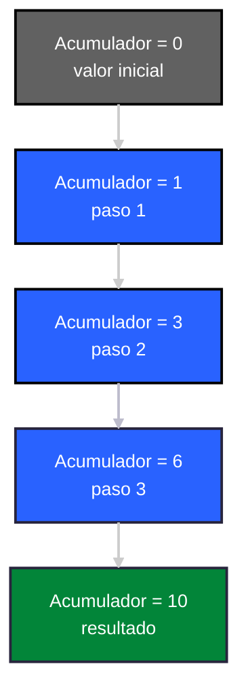
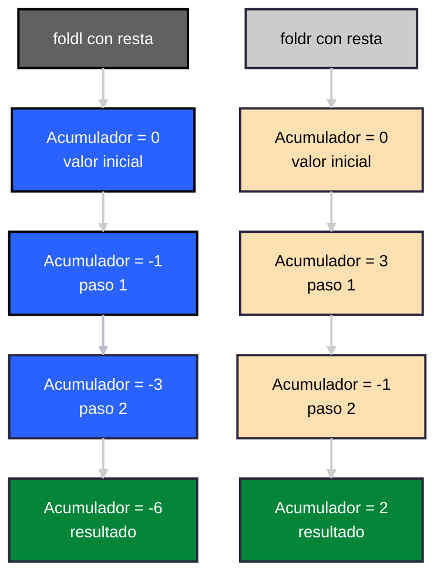
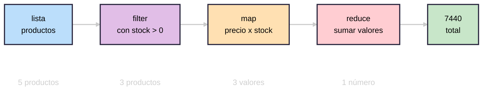

---

Materia: Programación Lógica y Funcional.

Profesor: Rene Solis Reyes.

Unidad: 1.

Alumno: Gonzalez Cristobal Omar.

Actividad: 1.1 Investigación vía Pull Request.

Título: Funciones de orden superior: map, filter y reduce explicadas desde cero.

Fecha: Lunes 7 de septiembre de 2026.

---

# Funciones de orden superior: `map`, `filter` y `reduce` explicadas desde cero

### Resumen

Las funciones de orden superior son un concepto fundamental de la programación funcional que permite trabajar con listas de datos de forma más clara que los bucles tradicionales. Esta investigación se centra en tres de las funciones más utilizadas dentro de este grupo: `map`, `filter` y `reduce`. Se explica la definición, el tipo genérico y el funcionamiento paso a paso de cada una, así como su uso combinado para resolver problemas más complejos. También se abordan las condiciones necesarias para aplicarlas correctamente y los errores más comunes al utilizarlas. Se concluye que, aunque no siempre son la opción más eficiente en términos de rendimiento, ofrecen ventajas importantes en cuanto a claridad, mantenibilidad y reducción de errores, lo cual explica su amplia adopción incluso en lenguajes que no son puramente funcionales.

---

### Introducción

Las funciones de orden superior son uno de los pilares de la programación funcional, ya que permiten trabajar con colecciones de datos de una forma más clara y expresiva que con los bucles tradicionales. Dentro de este grupo de funciones, `map`, `filter` y `reduce` destacan por ser las más utilizadas y por representar los tres patrones más comunes al procesar una lista: transformar, seleccionar y acumular.

El objetivo de esta investigación es comprender, desde cero, qué son estas tres funciones, cómo funcionan internamente y de qué forma se aplican en la práctica, sin asumir conocimientos previos sobre programación funcional.

Para lograrlo, se abordará la definición y el funcionamiento de cada función por separado, seguido de su uso combinado y de las buenas prácticas y errores comunes que se deben tener en cuenta al aplicarlas.

---

### Función de orden superior

**¿Qué hace que una función sea de orden superior?**

Una función es de orden superior si toma una función como argumento o devuelve una función como resultado. En el caso de map, filter y reduce, se cumple la primera condición: son funciones que reciben otra función como parámetro para determinar cómo se debe operar sobre los datos.

Para que existan las funciones de orden superior, es necesario que el lenguaje trate las funciones como valores de primera clase. Es decir, el "orden superior" es el uso que se le da a esa capacidad de lenguaje.

**El problema que resuelven**

A continuación se presentan dos ejemplos en pseudocódigo mostrando el antes y después de utilizar las funciones de orden superior:

Antes (con bucles, estilo imperativo)

```
resultado = []
para cada elemento en lista:
    si condicion(elemento):
        resultado.agregar(transformar(elemento))
```

Después (con orden superior)

```
resultado = map(transformar, filter(condicion, lista))
```

La idea clave a resaltar es que, en el primer caso, el programador tiene que escribir paso a paso cómo se recorre la lista (crear una lista vacía, iterar, revisar la condición, agregar). En el segundo caso, solo se dice qué se quiere hacer ("filtrar esto, transformar esto") y el "cómo" queda escondido dentro del map y filter.


Estas tres funciones (map, filter, reduce) son las de orden superior más comunes y básicas, porque cubren los tres patrones que más se repiten al trabajar con colecciones: transformar, seleccionar y acumular.

---

### `map` en detalle

**Definición**

`map` es una función de orden superior que recibe una función y una colección (por ejemplo, una lista), y devuelve una nueva colección donde cada elemento es el resultado de aplicar esa función al elemento correspondiente de la colección original.

Un punto importante a resaltar es que map no modifica la lista original, sino que crea una lista nueva.

**Firma o tipo genérico**

A continuación se muestra un ejemplo de firma o tipo genérico de `map`, escrito en Haskell:

```haskell
map :: (a -> b) -> [a] -> [b]
```

`map` recibe una función que convierte un valor de tipo "a" en uno de tipo "b", recibe una lista de elementos tipo "a", y devuelve una lista de elementos de tipo "b". El tipo de entrada y el de salida no tienen que ser iguales, aunque pueden serlo.

**Ejemplos progresivos**

A continuación se presentan tres ejemplos en pseudocódigo usando `map` para comprender mejor su utilidad en diferentes situaciones:

Ejemplo 1, duplicar números:

```
numeros = [1, 2, 3, 4]
resultado = map (x -> x * 2, numeros)
// resultado: [2, 4, 6, 8]
```

Ejemplo 2, convertir tipos:

```
numeros = [1, 2, 3]
resultado = map(x -> texto(x), numeros)
// resultado: ["1", "2", "3"]
```

Ejemplo 3, transformar estructuras más complejas:

```
personas = [{nombre: "Ana", edad:20}, {nombre: "Luis", edad: 25}]
resultado = map(p -> p.nombre, personas)
// resultado: ["Ana", "Luis"]
```

Con estos tres ejemplos se muestra que `map` sirve tanto para operaciones matemáticas simples como para transformar el tipo de dato o extraer información de estructuras más complejas.

**Qué no es `map`**

A continuación se muestra un ejemplo en pseudocódigo de lo que no es `map`:

```
// Esto es un bucle que muta la lista
para i desde 0 hasta longitud(numeros):
    numeros[i] = numeros[i] * 2
```

La diferencia clave es que `map` siempre devuelve una lista nueva y deja la original intacta, mientras que el bucle de arriba cambia la lista existente.

---

### `filter` en detalle

**Definición**

`filter` es una función de orden superior que recibe una función (llamada predicado) y una colección, y devuelve una nueva colección que contiene únicamente los elementos que cumplen esa condición. Un predicado es simplemente una función que, al evaluarla, devuelve verdadero o falso.

Al igual que `map`, `filter` genera una lista nueva con los elementos que pasaron la condición.

**Firma o tipo genérico**

A continuación se muestra un ejemplo de la firma o tipo genérico de `filter`, escrito en Haskell:

```haskell
filter :: (a -> Bool) -> [a] -> [a]
```

`filter` recibe una función que toma un valor de tipo "a" y devuelve un booleano (Bool), recibe una lista de elementos tipo "a", y devuelve otra lista, pero del mismo tipo "a". Esto es distinto a map, donde el tipo de salida podía cambiar: en `filter`, la lista resultante siempre tiene elementos del mismo tipo que la lista original, porque `filter` no transforma nada, solo selecciona.

**Ejemplos progresivos**

A continuación se presentan tres ejemplos en pseudocódigo usando `filter` para comprender mejor su utilidad en diferentes situaciones:

Ejemplo 1, números pares:

```
numeros = [1, 2, 3, 4, 5, 6]
resultado = filter(x -> x % 2 == 0, numeros)
// resultado: [2, 4, 6]
```

Ejemplo 2, filtrar por longitud de texto:

```
palabras = ["sol", "computadora", "luz", "programacion"]
resultado = filter(p -> longitud(p) > 4, palabras)
// resultado: ["computadora", "programacion"]
```

Ejemplo 3, filtrar estructuras más complejas:

```
personas = [{nombre: "Ana", edad: 20}, {nombre: "Luis", edad: 16}, {nombre: "Marta", edad: 30}]
resultado = filter(p -> p.edad >= 18, personas)
// resultado: [{nombre "Ana", edad: 20}, {nombre: "Marta", edad: 30}]
```

Con esto se muestra que `filter` funciona igual de bien para condiciones numéricas, sobre texto, o sobre estructuras de datos más elaboradas.

**Relación entre predicado y función pura**

Es necesario remarcar que para que `filter` funcione de forma predecible, el predicado debe ser una función pura, es decir, que siempre devuelva el mismo resultado para la misma entrada y no dependa de nada externo (como una variable global o un valor aleatorio). Si el predicado no es puro, `filter` podría comportarse de forma inconsistente entre una ejecución y otra.

---

### `reduce` en detalle

**Definición**

`reduce` (también llamado `fold` en varios lenguajes, como Haskell) es una función de orden superior que recibe una función combinadora, un valor inicial (llamado acumulador) y una colección, y devuelve un único valor como resultado de ir combinando cada elemento de la colección con el acumulador, paso a paso.

A diferencia de `map` y `filter`, que devuelven una nueva colección, `reduce` devuelve un solo valor: puede ser un número, un texto, una lista nueva, o incluso una estructura más compleja, dependiendo de cómo se defina la función combinadora.

**Firma o tipo genérico**

A continuación se muestra un ejemplo de firma o tipo genérico de `reduce`, escrito en Haskell (donde se conoce como `foldl` fold hacia la izquierda):

```haskell
foldl :: (b -> a -> b) -> b -> [a] -> b
```

`foldl` recibe una función que toma el acumulador (tipo "b") y un elemento de la lista (tipo "a"), y devuelve un nuevo acumulador (tipo "b"); recibe también un valor inicial de tipo "b"; recibe una lista de elementos tipo "a"; y devuelve un único valor de tipo "b". Es la más "flexible" de las tres, porque el tipo de salida no depende del tipo de la lista original, sino de cómo se defina el acumulador.

**El acumulador y el valor inicial**

Para que se comprenda mejor cómo va cambiando el acumulador en cada paso, se presenta un ejemplo simple en pseudocódigo donde se esta sumando una lista:

```
numeros = [1, 2, 3, 4]
resultado = reduce((acumulador, elemento) -> acumulador + elemento, 0, numeros)
```

Y aquí se puede observar de forma grafica paso a paso lo que sucede internamente:



**fold left vs fold right**

Existen dos formas de recorrer la lista al reducir:

- fold left (`foldl`): recorre la lista de izquierda a derecha, combinando el acumulador con el primer elemento, luego con el segundo, y así sucesivamente.

- fold right (`foldr`): recorre la lista de derecha a izquierda, combinando el último elemento con el acumulador primero.

Con operaciones como la suma, el resultado final es el mismo sin importar la dirección, porque la suma es asociativa. Pero con operaciones que no son asociativas (por ejemplo, la resta), el resultado puede cambiar según la dirección.

A continuación, se presenta un ejemplo simple de las dos formas de fold con resta en pseudocódigo:

```
numeros = [1, 2, 3]

foldl con resta: ((0 - 1) - 2) - 3 = -6
foldr con resta: 1 - (2 - (3 - 0)) = 2
```

Aquí el mismo ejemplo de forma grafica paso a paso:



**Por qué `reduce` es la más general de las tres**

Se puede mostrar que tanto `map` como `filter` pueden escribirse usando `reduce`, lo que demuestra que `reduce` es, en el fondo, la función más fundamental de las tres.

Ejemplo en pseudocódigo en donde `map` esta usando `reduce`:

```
map(f, lista) = reduce((acumulador, elemento) -> acumulador + [f(elemento)], [], lista)
```

Ejemplo en pseudocódigo en donde `filter` esta usando `reduce`:

```
filter(predicado, lista) = reduce((acumulador, elemento) -> si predicado(elemento) entonces acumulador + [elemento] sino acumulador, [], lista)
```

Con esto se cierra la idea de que `map` y `filter` son, en cierto sentido, casos particulares de un patrón más general de acumulación, que es lo que representa `reduce`.

---

### Encadenamiento y uso práctico

**¿Por qué encadenar funciones?**

Hasta ahora se explicó cada función por separado, pero en la práctica real casi nunca se usan solas: lo común es encadenarlas para resolver un problema en varios pasos, donde la salida de una función se convierte en la entrada de la siguiente. Esto forma lo que se conoce como un pipeline de procesamiento de datos.

**Ejemplo paso a paso**

A continuación, se presenta un ejemplo en pseudocódigo con datos un poco más realistas, para que se note el valor práctico. Por ejemplo, procesar una lista de productos de una tienda:

```
productos = [
    {nombre: "Laptop", precio: 1200, stock: 5},
    {nombre: "Mouse", precio: 25, stock: 0},
    {nombre: "Teclado", precio: 45, stock: 12},
    {nombre: "Monitor", precio: 300, stock: 3},
    {nombre: "Cable", precio: 8, stock: 0}
]
```

El objetivo es calcular el valor total del inventario, pero solo de los productos que sí tienen stock disponible.

Paso 1: filtrar los que tienen stock:

```
disponibles = filter(p -> p.stock > 0, productos)
// disponibles: Laptop, Teclado, Monitor
```

Paso 2: transformar cada producto a su valor total (precio x stock):

```
valores = map(p -> p.precio * p.stock, disponibles)
// valores: [6000, 540, 900]
```

Paso 3: sumar todos los valores:

```
total = reduce((acumulador, valor) -> acumulador + valor, 0, valores)
// total: 7440
```

**La misma operación, pero encadenada**

Aquí se muestra cómo, en la práctica, estos tres pasos suelen escribirse en una sola línea o expresión, sin necesidad de guardar resultados intermedios:

```
total = reduce(
    (acumulador, valor) -> acumulador + valor,
    0,
    map(p -> p.precio * p.stock, filter(p -> p.stock > 0, productos))
```

Aunque se escriba en una sola expresión, la lógica sigue siendo la misma de los tres pasos por separado (primero se filtra, después se transforma, y al final se reduce a un solo valor). Encadenar no cambia el comportamiento, solo la forma de escribirlo.

**El operador pipe**

En algunos lenguajes, como Elixir, existe una notación especial (el operador pipe) que permite escribir este mismo encadenamiento de una forma más legible, leyendo el flujo de izquierda a derecha en lugar de anidar las funciones.

**Por qué es útil este patrón**

Filtrar, transformar y acumular es un patrón extremadamente común en el procesamiento de datos del mundo real: se ve en análisis de datos, en consultas a base de datos, en procesamiento de listas de usuarios, ventas, registros, etc. Este patrón es justamente la razón por la que `map`, `filter` y `reduce` son tan valoradas en la programación funcional: cubren la mayoría de las operaciones que se necesitan sobre colecciones sin tener que escribir bucles manuales.



---

### Rendimiento y buenas prácticas

**¿Son más lentas que un bucle tradicional?**

Sí, `map`, `filter` y `reduce` pueden tener un pequeño costo adicional comparadas con un bucle tradicional, porque internamente siguen haciendo un recorrido de la lista, pero además suman la llamada a una función en cada paso (la función que se les pasa como argumento)y, en muchos casos, crean listas intermedias nuevas en cada operación encadenada.

Sin embargo, es importante aclarar que esta diferencia suele ser mínima y, en la mayoría de los casos reales, no se nota. Los lenguajes funcionales maduros (como Haskell) además cuentan con optimizaciones especiales, como la evaluación perezosa, que ayudan a que estas funciones no recorran la lista más veces de las necesarias.

**Listas intermedias**

Cuando se encadenan varias funciones, cada una podría generar una lista nueva antes de pasar a la siguiente. A continuación se muestra un ejemplo en pseudocódigo:

```
resultado = reduce(f, 0, map(g, filter(p, lista)))
```

En teoría, esto podría generar dos listas intermedias: una después de `filter` y otra despues de `map`, antes de llegar a `reduce`. En listas muy grandes, esto si puede notarse en el uso de memoria.

**¿Por qué vale la pena usarlas de todas formas?**

- Legibilidad: el código es más corto y expresa mejor la intención, lo cual reduce errores humanos.

- Menos errores comunes de los bucles: como olvidar actualizar un índice, salirse del rango de la lista, o modificar la lista mientras se recorre.

- Más fácil de probar y depurar: al ser funciones puras, cada paso se puede probar de forma aislada.

- El costo de rendimiento casi siempre es insignificante comparado con la ganancia en claridad del código, salvo en sistemas donde el rendimiento es absolutamente crítico (como programación de bajo nivel o sistemas en tiempo real).

**Errores comunes al usar estas funciones**

A continuación, se enlistan errores típicos que se cometen al aprenderlas:

- Olvidar el valor inicial en `reduce`: si no se proporciona, algunos lenguajes toman el primer elemento de la lista como valor inicial por defecto, lo que puede generar resultados inesperados si no se tiene cuidado.
 
- Confundir `map` con un simple recorrido (forEach): usar `map` solo para "hacer algo" con cada elemento (como imprimir) sin aprovechar el valor que devuelve, cuando en ese caso convendría usar una función pensada solo para recorrer, no transformar.
 
- Olvidar que el predicado de `filter` debe devolver un booleano: usar una función que devuelva otro tipo de valor puede generar comportamientos confusos según el lenguaje.
 
 **Costo vs. beneficio**

 El pequeño costo de rendimiento de estas funciones casi siempre se compensa con creces gracias a la claridad, mantenibilidad y menor cantidad de errores que aportan al código, razón por la cual se han vuelto un estándar tan extendido incluso en lenguajes que no son puramente funcionales.

---

 ### Conclusiones

 Después de realizar esta investigación sobre las funciones de orden superior se logró comprender un poco más lo importantes y útiles que son. Es cierto que no se pueden utilizar en todos los escenarios, pero en los que si se puede, ofrecen ventajas importantes, como se mencionó en el ultimo punto (código más corto, menos errores, y que `map` y `filter` ofrecen una nueva lista como resultado). También se pudo observar lo fuertes que son en conjunto, ofreciendo una estructura que es bastante clara y de uso frecuente. Aunque al principio le cueste comprenderlas a alguien que no conozca el tema, es muy recomendable hacerlo. Por último, también se abarcó el tema de los errores comunes y se mencionaron las condiciones que deben tener las funciones de orden superior para evitar tener resultados inesperados. Es muy importante comprender esta parte para poder usarlas sin problemas y entender en qué situaciones es recomendable aplicarlas.

 ---

### Bibliografía en formato IEEE

[1] J. A. Alonso Jiménez, "Tema 7: Funciones de orden superior," Informática (Curso 2019-20), Dept. Ciencias de la Computación e I.A., Universidad de Sevilla. Disponibilidad: https://www.cs.us.es/~jalonso/cursos/i1m/temas/tema-7.html. [Accedido: 07-sep-2026]

[2] M. Y. U. Khalid, "4. Map, Filter y Reduce," Python Intermedio, trad. de ellibrodepython.com. Disponibilidad: https://python-intermedio.readthedocs.io/es/latest/map_filter.html. [Accedido: 07-sep-2026]

[3] Oxford Research Software Engineering, "Higher-Order Functions," Software Architecture in Python, University of Oxford. Disponibilidad: https://train.rse.ox.ac.uk/material/HPCu/software_architecture_and_design/functional/higher_order_functions_python. [Accedido: 07-sep-2026]

[4] Wikipedia, "Map (higher-order function)," Wikipedia, The Free Encyclopedia, Nov. 16, 2025. Disponibilidad: https://en.wikipedia.org/wiki/Map_(higher-order_function. [Accedido: 07-sep-2026]

[5] DataCamp, "Función map() de Python: Una guía completa," DataCamp Tutorials, 11-dic-2025. Disponibilidad: https://www.datacamp.com/es/tutorial/python-map-function. [Accedido: 07-sep-2026]

[6] A. Crites, "map vs. for loop," Medium, 22-jul-2018. Disponibilidad: https://medium.com/@ExplosionPills/map-vs-for-loop-2b4ce659fb03. [Accedido: 07-sep-2026]

[7] J. Reina, "Intro to the filter function," DEV Community, 15-sep-2017. Disponibilidad: https://dev.to/jreina/intro-to-the-filter-function. [Accedido: 07-sep-2026]

[8] L. Pozo Ramos, "filter() | Python's Built-in Functions," Real Python, 18-ago-2026. Disponibilidad: https://realpython.com/ref/builtin-functions/filter/. [Accedido: 07-sep-2026]

[9] Mimo, "Python filter(): Syntax, Usage, and Examples," Mimo Glossary. Disponibilidad: https://mimo.org/glossary/python/filter. [Accedido: 07-sep-2026]

[10] L. Pozo Ramos, "Python's reduce(): From Functional to Pythonic Style," Real Python, 29-jun-2020. Disponibilidad: https://realpython.com/python-reduce-function/. [Accedido: 07-sep-2026]

[11] A. Kumar y B. Whitfield (Actualizador), "Guide to the JavaScript Reduce() Method," Built In, 03-feb-2025. [En línea]. Disponible: https://builtin.com/software-engineering-perspectives/javascript-reduce. [Accedido: 07-sep-2026]

[12] R. Braithwaite (raganwald), "foldl, foldr, and associative order," raganwald.com, 10-abr-2017. [En línea]. Disponible: https://raganwald.com/2017/04/10/foldl-foldr.html. [Accedido: 07-sep-2026]

[13] 33 JavaScript Concepts, "map, reduce, filter," 33 JavaScript Concepts. [En línea]. Disponible: https://33jsconcepts.com/concepts/map-reduce-filter. [Accedido: 07-sep-2026]

[14] El Pythonista, «Map, Filter y Reduce en Python: Programación Funcional Completa». Accedido: 7 de septiembre de 2026. [En línea]. Disponible en: https://elpythonista.com/map-filter-y-reduce-en-python-programacion-funcional-completa-2025

[15] Elixir School, «Operador Pipe», Elixir School. Accedido: 7 de septiembre de 2026. [En línea]. Disponible en: https://elixirschool.com/es/lessons/basics/pipe_operator
