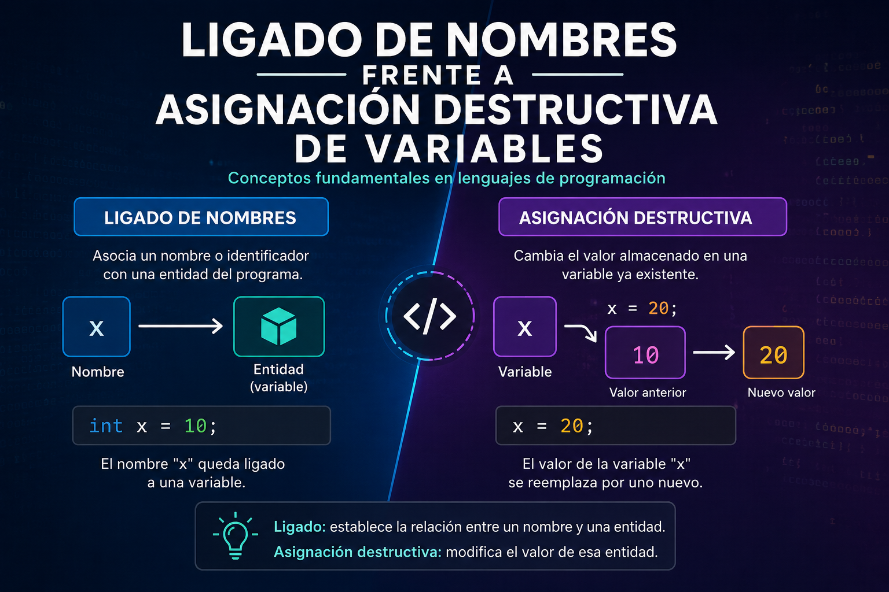

# Ligado de Nombres frente a Asignación Destructiva de Variables

### Nombre y apellido: Garcia Caro Carlos Alejandro
### Numero de control: 23211963
### Horario: 4 pm a 5 pm

## 📌 Introducción

En los lenguajes de programación existen dos formas fundamentalmente distintas de asociar un valor con un identificador (nombre): el **ligado de nombres** (*name binding*) y la **asignación destructiva** (*destructive assignment*). Aunque a simple vista ambas parecen cumplir la misma función —"guardar un valor en una variable"—, sus implicaciones semánticas, especialmente en el paradigma funcional, son muy diferentes.

---

## 🔗 1. Ligado de Nombres (Name Binding)

### Definición
El ligado de nombres consiste en **asociar un identificador con un valor de forma permanente** dentro de un ámbito (scope) determinado. Una vez que el nombre queda ligado a un valor, esa asociación **no puede cambiarse**.

### Características principales
- Es propio del **paradigma funcional** (Scheme, Haskell, Lisp, Erlang, etc.).
- Genera **transparencia referencial**: una expresión con el mismo nombre siempre produce el mismo resultado.
- No existe el concepto de "cambiar el valor de la variable"; en su lugar, se crean **nuevos ligados** (nuevos ámbitos).
- Facilita el razonamiento matemático sobre el código, ya que un nombre nunca "cambia por debajo" mientras se ejecuta un programa.

### Ejemplo (Scheme)
```scheme
(let ((x 5))
  (+ x 1)) ; x sigue siendo 5, no se modifica
```

### Formas comunes de ligado
| Constructo | Descripción |
|---|---|
| `let` | Ligado local, ámbito limitado al cuerpo del `let` |
| `let*` | Ligado secuencial (cada variable puede usar las anteriores) |
| `letrec` | Ligado recursivo (permite referencias mutuas, útil para funciones recursivas) |
| Parámetros de función | Ligado implícito al invocar la función |

---

## ♻️ 2. Asignación Destructiva (Destructive Assignment)

### Definición
La asignación destructiva **modifica el valor almacenado en una variable ya existente**, sobrescribiendo (destruyendo) el valor anterior. Es la operación típica de los lenguajes imperativos.

### Características principales
- Es propia del **paradigma imperativo/procedural** (C, Java, Python, JavaScript, etc.).
- Introduce el concepto de **estado mutable**.
- Rompe la transparencia referencial: el valor de una variable depende del **momento en que se consulta**, no solo del contexto.
- Facilita modelar procesos que cambian con el tiempo (contadores, acumuladores, estructuras de datos mutables).

### Ejemplo (Scheme con `set!`)
```scheme
(define x 5)
(set! x (+ x 1)) ; x ahora es 6, el valor anterior se pierde
```

### Ejemplo equivalente en un lenguaje imperativo
```python
x = 5
x = x + 1  # x ahora vale 6
```

---

## ⚖️ 3. Comparación entre ambos enfoques

| Aspecto | Ligado de nombres | Asignación destructiva |
|---|---|---|
| Paradigma asociado | Funcional | Imperativo |
| Mutabilidad | Inmutable | Mutable |
| Transparencia referencial | Se preserva | Se pierde |
| Facilidad para razonar/depurar | Alta | Menor (depende del orden de ejecución) |
| Representación del "cambio" | Nuevo ámbito / nuevo ligado | Sobrescritura del valor existente |
| Ejemplo de operador | `let`, `lambda` | `set!`, `=` |
| Efectos secundarios | No genera | Sí genera |

---

## 🧠 4. Importancia conceptual

1. **Modelo mental distinto**: el ligado de nombres nos hace pensar en términos de *sustitución* (como en matemáticas), mientras que la asignación destructiva nos hace pensar en términos de *estado que cambia en el tiempo*.
2. **Efectos secundarios (side effects)**: la asignación destructiva introduce efectos secundarios, lo cual puede complicar la depuración y el razonamiento formal sobre el programa, especialmente en entornos concurrentes.
3. **Closures y entornos**: en lenguajes como Scheme, aunque el ligado es inmutable, se puede combinar con `set!` para crear **closures con estado**, generando estructuras como contadores o generadores.
4. **Recolección de basura y memoria**: cada nuevo ligado puede generar nuevas referencias en memoria, mientras que la asignación destructiva reutiliza el mismo espacio de memoria.

---

## 🧩 5. Ejemplo combinado: Closure con estado mutable

```scheme
(define (crear-contador)
  (let ((contador 0))          ; ligado de nombre: contador
    (lambda ()
      (set! contador (+ contador 1)) ; asignación destructiva
      contador)))

(define mi-contador (crear-contador))
(mi-contador) ; => 1
(mi-contador) ; => 2
(mi-contador) ; => 3
```

Este ejemplo demuestra cómo ambos conceptos **coexisten**: `let` liga el nombre `contador` a un valor inicial dentro de un entorno (closure), y `set!` lo modifica destructivamente en cada llamada, manteniendo el estado entre invocaciones.

---

## ✅ 6. Conclusiones

- El **ligado de nombres** favorece un estilo declarativo, predecible y matemáticamente puro, típico de la programación funcional.
- La **asignación destructiva** favorece un estilo imperativo, útil para modelar estados cambiantes, pero introduce riesgos como efectos secundarios y dependencia del orden de ejecución.
- Comprender la diferencia entre ambos es clave para entender por qué los lenguajes funcionales evitan (o restringen) la mutación, y por qué los lenguajes imperativos dependen de ella para gestionar el estado del programa.
- La combinación de ambos conceptos (como en el ejemplo del contador) es la base de estructuras poderosas como los **closures con estado**, ampliamente usadas en programación funcional con estado controlado.

---

## 📚 Referencias sugeridas

[1] H. Abelson and G. J. Sussman, *Structure and Interpretation of Computer Programs*, 2nd ed. Cambridge, MA, USA: MIT Press, 1996.

[2] Racket Documentation, "let, let*, and letrec," *Racket Reference*. [Online]. Disponible en: https://docs.racket-lang.org/reference/let.html. [Accedido: 1-sep-2026].

[3] Racket Documentation, "set!," *Racket Reference*. [Online]. Disponible en: https://docs.racket-lang.org/reference/set_.html. [Accedido: 1-sep-2026].

[4] G. J. Sussman, "6.001 Structure and Interpretation of Computer Programs," *MIT OpenCourseWare*, Massachusetts Institute of Technology, Cambridge, MA, USA, 2005. [Online]. Disponible en: https://ocw.mit.edu/. [Accedido: 1-sep-2026].
