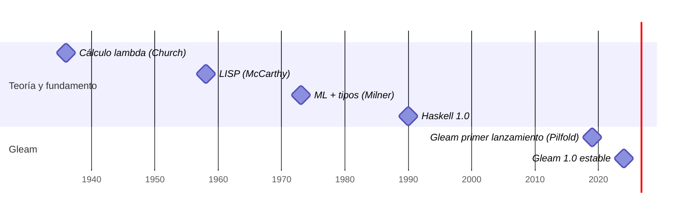

# Línea de tiempo de la programación funcional: de 1930 a Gleam (2024)
---
### Alumno: CAMACHO OTAÑEZ JUAN PABLO
### Docente: SOLIS REYES RENE
### Materia: Programación Logica y Funcional
### Horario: 4:00pm a 5:00pm
---

## ¿Qué es la programación funcional?

La programación funcional es un **paradigma de programación** que **se basa en el uso de funciones matemáticas para transformar datos y resolver problemas**. Utiliza el **cálculo lambda** y, en particular, funciones puras para modelar soluciones de software. Estas se caracterizan por no tener efectos secundarios y por depender únicamente de los argumentos de entrada a la hora de obtener un resultado.

Su característica distintiva es el **enfoque declarativo en lugar del imperativo**. Es decir, no se describe cada paso para la ejecución de un proceso; por el contrario, se define qué se debe hacer para que el lenguaje de programación se encargue de la implementación concreta.

Este paradigma se utiliza, sobre todo, **para mejorar la concurrencia y la inmutabilidad en los programas**. Esta última, que se refiere a la incapacidad de modificar los datos una vez creados, ayuda a evitar errores difíciles de rastrear y facilita el paralelismo, ya que los datos compartidos entre procesos no se pueden alterar de forma inesperada.

La programación funcional tiene sus propios principios y paradigmas:

- **Funciones puras.** El resultado depende solo de los argumentos; la misma entrada siempre producirá la misma salida. Facilita el análisis del código y lo hace previsible.
- **Inmutabilidad.** Las estructuras de datos ya creadas no se pueden modificar. Para evitar errores asociados a su manipulación cuando se comparten, se crean versiones nuevas de la misma estructura con las modificaciones pertinentes.
- **Funciones de orden superior.** Pueden recibir otras funciones como argumentos o devolverlas como resultados. Por tanto, el código se puede reutilizar para operaciones complejas y ofrece mayor flexibilidad.
- **Composición de funciones.** Las funciones complejas se pueden construir a partir de varias simples. Las *pipelines* de procesamiento de datos tienen, entonces, una composición modular y clara.
- **Recursión.** Es el método que se usa para iterar sobre datos en vez de usar bucles tradicionales. Va en la misma línea de la inmutabilidad, dado que cada llamada recursiva trabaja con una nueva versión de un dato.

> **Imagen 1:** Una función como caja negra: entra un dato, sale un resultado. Fuente: Barbulat / Getty Images.

---

## Línea de tiempo de la programación funcional

### 1930-1936 - Cálculo lambda

Alonzo Church formaliza el cálculo lambda, el fundamento matemático de los lenguajes funcionales. Inicialmente se empleó como instrumento matemático formal para el estudio de las funciones y su recursividad. Se puede considerar uno de los lenguajes de programación universales más minimalistas y, sorprendentemente, no utiliza números indoarábigos, caracteres alfanuméricos ni booleanos, sino tipos de datos basados en funciones; sin embargo, puede representar cualquier máquina de Turing.

### 1958 - LISP

John McCarthy crea LISP, el primer lenguaje funcional y el más antiguo aún en uso después de FORTRAN. Es el segundo lenguaje de programación de mayor antigüedad; se publicó en el **MIT** después de Fortran y poco antes de COBOL.

Fue creado para seguir la notación matemática del cálculo lambda de Alonzo Church. **LISP** introdujo la posibilidad de definir estructuras de datos arborescentes y tipos de datos dinámicos. Aunque en los años noventa sufrió cierto declive, a partir del libro de Peter Seibel despertó de nuevo interés; actualmente, **Common Lisp** y **Scheme** son las versiones más extendidas.

### 1973 - ML

Robin Milner, en Edimburgo, inventa ML, que introduce la inferencia de tipos Hindley-Milner, base del tipado moderno.

ML (Metalanguage) es un lenguaje de programación funcional desarrollado en 1973 por Robin Milner y su equipo en la Universidad de Edimburgo.
Diseñado originalmente para implementar demostradores automáticos de teoremas (como el sistema LCF).
Sus características clave incluyen:
- **Inferencia de tipos (Hindley-Milner).** Permite que el compilador deduzca automáticamente los tipos de datos de las expresiones sin necesidad de que el programador los declare manualmente,
- **Manejo de excepciones.** Fue uno de los pioneros en integrar sistemas estructurados para el control de errores.
- **Gestión de memoria**. Introdujo el uso automático de recolección de basura.
- **Sistema de módulos y coincidencia de patrones (pattern matching).** Facilitó la estructuración de código complejo y la manipulación de estructuras de datos algebraicas.

### 1990 - Haskell 1.0

Se define Haskell 1.0, el estándar abierto del paradigma puramente funcional y perezoso. Haskell es un lenguaje de **programación puramente funcional** cuya primera versión fue lanzada en 1990.

Su nombre proviene del matemático Haskell Brooks Curry, que sentó las bases de los lenguajes de programación funcional con su trabajo sobre lógica combinatoria entre 1920 y 1960. Haskell se basa en el **cálculo lambda**. Los programas escritos en Haskell se representan como funciones matemáticas; estas no tienen efectos secundarios y devuelven el mismo resultado ante la misma entrada, por lo que el estado del programa no cambia.

### 2012 - Elixir y Elm

Elixir aporta una sintaxis amigable a la máquina virtual BEAM; Elm lleva la programación funcional pura y tipada al *frontend* web, inspirando a una nueva generación.

**Elixir** es un lenguaje funcional de tipado dinámico que se basa en la máquina virtual de Erlang y se compila a código de bytes de Erlang. Encapsula la programación funcional con estado inmutable y un enfoque de concurrencia basado en actores en una sintaxis moderna y elegante.

**Elm** es un lenguaje de programación funcional diseñado para facilitar la creación de interfaces de usuario interactivas. Desarrollado por Evan Czaplicki, surgió como respuesta a los desafíos del desarrollo de aplicaciones web complejas, donde la mantenibilidad, la escalabilidad y la ausencia de errores son vitales.

### 2024 - Gleam 1.0

Primera versión estable de Gleam, que compila a BEAM y JavaScript. **Gleam** es un lenguaje de programación funcional, estáticamente tipado y diseñado para construir sistemas de software escalables, predecibles y de bajo estrés.

Esta versión cubre todas las API públicas que se encuentran en el repositorio principal de Gleam en Git:

- El diseño del lenguaje Gleam.
- El compilador Gleam.
- La herramienta de compilación Gleam.
- El gestor de paquetes Gleam.
- El formateador de código Gleam.
- El servidor de lenguaje Gleam.
- La API WASM del compilador Gleam y los enlaces JavaScript.

Sus características principales incluyen:

- **Ecosistema y ejecución:** se ejecuta en la máquina virtual de **Erlang** (BEAM), conocida por su gran tolerancia a fallos y alta escalabilidad en producción.
- **Sistema de tipos e inspiración:** posee un análisis estático robusto con inferencia de tipos inspirado en lenguajes como Elm, OCaml y Rust.
- **Simplicidad:** prioriza un diseño consistente con una curva de aprendizaje rápida.
- **Herramientas integradas:** incluye en su flujo de trabajo un compilador rápido, gestor de paquetes, formateador de código, servidor de lenguaje (LSP) para editores de texto y soporte para WASM.

---

# Conclusión:
La programación funcional tiene su origen en el calculo lambda el cual nos dice que toda maquina de Turing puede representarse mediante funcionaes, que reciben un argumento sin depender de numeros, variables, bucles ni instrucciones. El primer lenguaje funcional fue LISP el cual es el lenguaje funcional mas antiguo aun en uso. Posteriormente se crearon ML, HASKELL, Elixir y ELM hasta llegar aa GLEM.
La principal caracteristica de la programacion funcional es que se basa en el principio del calculo lambda, es decir solo utilizando funciones.
A diferencia de la programacion logica la cual se basa en el principio de la regla logica (Horn). 
La diferencia clave es que en programación funcional tu decides el orden mientras que el programación lógica, el programa decide que el orden.

## Fuentes

[1]  beecrowd, "Elm," beecrowd Blog. [Online]. Available: https://beecrowd.com/es/blog-posts/elm-3/

[2]  Inesdi, "Definición y aplicaciones de la programación funcional," Inesdi Blog. [Online]. Available: https://www.inesdi.com/blog/programacion-funcional/

[3]  IONOS, "¿Qué es Haskell? Todo sobre el lenguaje de programación," IONOS Digital Guide. [Online]. Available: https://www.ionos.mx/digitalguide/paginas-web/desarrollo-web/que-es-haskell/

[4]  L. Pilfold, "Gleam version 1," Gleam, Mar. 4, 2024. [Online]. Available: https://gleam.run/news/gleam-version-1/

[5]  Serokell, "Introduction to Elixir," Serokell Blog. [Online]. Available: https://serokell.io/blog/introduction-to-elixir

[6]  UNED, "Conferencia: Cálculo lambda (λ-calculus)," Extensión Universitaria en Madrid, 27 de noviembre de 2025. [Online]. Available: https://extension.uned.es/actividad/idactividad/47841

[7]  Universitat Politècnica de València, "LISP," Museo de Informática 2.0. [Online]. Available: https://museo.inf.upv.es/lisp/
