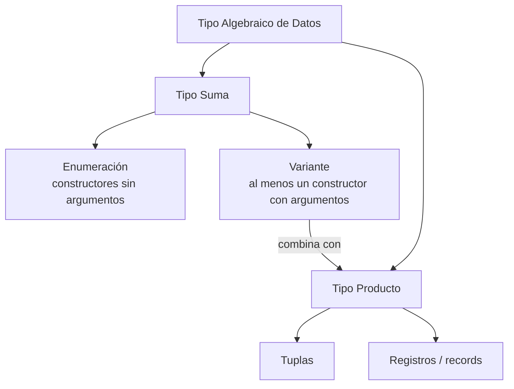

# Tipos Algebraicos de Datos Sencillos: Enumeraciones y Variantes

**Materia:** Programación Lógica y Funcional
**Autor:** Padilla Dylan Alexis
**Profesor:** Solís René
**Número de control:** 23212038

---

## Tabla de contenido

1. [Introducción](#1-introducción)
2. [Desarrollo técnico](#2-desarrollo-técnico)
   - [2.1 ¿Qué es un tipo algebraico de datos?](#21-qué-es-un-tipo-algebraico-de-datos)
   - [2.2 Enumeraciones: el caso más simple](#22-enumeraciones-el-caso-más-simple)
   - [2.3 Variantes: constructores con datos asociados](#23-variantes-constructores-con-datos-asociados)
   - [2.4 Tipos suma y tipos producto](#24-tipos-suma-y-tipos-producto)
   - [2.5 Coincidencia de patrones (*pattern matching*)](#25-coincidencia-de-patrones-pattern-matching)
   - [2.6 Comparación entre lenguajes funcionales](#26-comparación-entre-lenguajes-funcionales)
3. [Ejemplos funcionales](#3-ejemplos-funcionales)
   - [3.1 Enumeración simple (Haskell)](#31-enumeración-simple-haskell)
   - [3.2 Enumeración simple (OCaml)](#32-enumeración-simple-ocaml)
   - [3.3 Variante con datos (Haskell) — `Maybe`/`FailableDouble`](#33-variante-con-datos-haskell--maybefailabledouble)
   - [3.4 Variante con datos (OCaml) — figuras geométricas](#34-variante-con-datos-ocaml--figuras-geométricas)
   - [3.5 Tipo recursivo: árbol binario](#35-tipo-recursivo-árbol-binario)
4. [Relación con la Programación Funcional](#4-relación-con-la-programación-funcional)
5. [Conclusiones](#5-conclusiones)
6. [Referencias (formato IEEE)](#6-referencias-formato-ieee)

---

## 1. Introducción

Uno de los pilares de los lenguajes de programación funcional modernos —como Haskell, OCaml, F# o Elm— es su sistema de tipos, y dentro de este, los **tipos algebraicos de datos** (*Algebraic Data Types*, ADT) ocupan un lugar central. A diferencia de los lenguajes imperativos clásicos, donde definir una nueva estructura de datos suele implicar clases, herencia o registros con banderas de control, la programación funcional ofrece un mecanismo declarativo, conciso y seguro en tiempo de compilación para modelar datos que pueden tomar **una entre varias formas posibles**.

Este documento se enfoca en el caso más sencillo e introductorio de los ADT: las **enumeraciones** (conjuntos cerrados de valores constantes) y las **variantes** (constructores que además transportan datos). El objetivo es comprender su fundamento matemático —la noción de "álgebra" de tipos suma y tipos producto—, su sintaxis en distintos lenguajes funcionales y su relación directa con otro pilar de la programación funcional: la **coincidencia de patrones** (*pattern matching*), que permite manipular estos datos de forma segura y exhaustiva.

El tema se relaciona directamente con los contenidos de Programación Lógica y Funcional porque los ADT son la base sobre la cual se construyen estructuras de datos inmutables (listas, árboles, opcionales, resultados de error) que luego se procesan mediante funciones puras y recursión, en lugar de mutación de estado.

---

## 2. Desarrollo técnico

### 2.1 ¿Qué es un tipo algebraico de datos?

Un **tipo algebraico de datos** es un tipo compuesto, formado por la combinación de otros tipos mediante dos operaciones fundamentales tomadas prestadas del álgebra: la **suma** (unión disjunta) y el **producto** (agrupación de varios valores) [1]. Se les llama "algebraicos" precisamente porque su definición sigue reglas análogas a la suma y el producto de números o conjuntos [2].

De manera informal, un ADT se declara enumerando uno o más **constructores** (también llamados *constructores de datos*), cada uno de los cuales puede o no llevar argumentos asociados [3]. En OCaml esta construcción recibe el nombre de *variant type* (tipo variante); en Haskell se define con la palabra clave `data`.

### 2.2 Enumeraciones: el caso más simple

Una **enumeración** es un tipo algebraico en el que todos los constructores son *nularios*, es decir, no reciben ningún argumento [3]. Cada constructor representa simplemente una etiqueta o valor constante distinto. Este es el caso más simple —y más cercano a los `enum` de lenguajes como C, Java o C++— pero con la ventaja de integrarse de forma nativa con el sistema de tipos y el *pattern matching* del lenguaje [4].

Ejemplo conceptual (días de la semana):

```
type dia = Lunes | Martes | Miércoles | Jueves | Viernes | Sábado | Domingo
```

Aquí `dia` es el **tipo**, y `Lunes`, `Martes`, etc., son los siete **constructores** posibles. Ningún constructor lleva datos adicionales: el conjunto de valores del tipo `dia` es exactamente esos siete elementos, ni uno más ni uno menos (a diferencia de representar los días con enteros, donde valores como `-5` o `42` serían "días" inválidos pero técnicamente representables).

### 2.3 Variantes: constructores con datos asociados

Cuando al menos uno de los constructores de un tipo algebraico **sí** recibe argumentos, ya no hablamos solo de una enumeración, sino de una **variante** en el sentido más general [5]. Cada constructor puede llevar cero, uno o varios valores de tipos distintos.

```
type figura =
  | Punto of float * float
  | Circulo of float * float * float   (* centro x, centro y, radio *)
  | Rectangulo of float * float * float * float
```

En este ejemplo, `Punto`, `Circulo` y `Rectangulo` son tres formas distintas y mutuamente excluyentes que puede tomar un valor de tipo `figura`, cada una acarreando la información numérica necesaria para describirla [1]. Esto es estrictamente más expresivo que una enumeración: el tipo no solo distingue **qué caso es**, sino que también **transporta datos relevantes para ese caso**.

> Una enumeración es, en realidad, el caso particular de una variante en la que todos los constructores tienen aridad cero [4].

### 2.4 Tipos suma y tipos producto

El nombre "algebraico" proviene de que estos tipos combinan dos operaciones [2]:

| Operación | Nombre común | Significado | Ejemplo |
|---|---|---|---|
| **Suma** (`\|`) | Unión disjunta / tipo *tagged* | El valor es **uno entre varios** casos posibles, cada uno etiquetado por su constructor | `Circulo of ... \| Rectangulo of ...` |
| **Producto** (tupla / registro) | Agrupación | El valor **combina simultáneamente** varios campos | `float * float` (par de coordenadas) |

Una variante como `figura` del apartado anterior combina ambas operaciones: es una **suma** de tres alternativas (`Punto`, `Circulo`, `Rectangulo`), y cada alternativa es a su vez un **producto** de dos o cuatro números [6].

Esta dualidad se resume en la siguiente tabla comparativa:

| Concepto | Tipo suma | Tipo producto |
|---|---|---|
| Pregunta que responde | "¿Cuál de estos casos es?" | "¿Qué valores tengo a la vez?" |
| Cardinalidad (número de valores posibles) | Suma de las cardinalidades de cada caso | Producto de las cardinalidades de cada campo |
| Ejemplo simple | `Booleano = Verdadero \| Falso` (2 valores) | `(Booleano, Booleano)` (2 × 2 = 4 valores) |
| Palabra clave típica | `data` / `type ... = A \| B` | Tupla `(a, b)` o `record { ... }` |

### 2.5 Coincidencia de patrones (*pattern matching*)

Los ADT no serían tan útiles sin un mecanismo para **desestructurarlos**. El *pattern matching* permite examinar qué constructor formó un valor y extraer, al mismo tiempo, los datos que ese constructor transporta [1]. El compilador puede además verificar que **todos** los casos posibles del tipo fueron considerados (verificación de exhaustividad), lo cual es una de las mayores ventajas de seguridad frente a las estructuras `switch` de los lenguajes imperativos, que no ofrecen esta garantía en tiempo de compilación.

```
let area figura =
  match figura with
  | Punto (_, _) -> 0.0
  | Circulo (_, _, r) -> 3.14159 *. r *. r
  | Rectangulo (x1, y1, x2, y2) -> abs_float (x2 -. x1) *. abs_float (y2 -. y1)
```

### 2.6 Comparación entre lenguajes funcionales

| Lenguaje | Palabra clave | Sintaxis de enumeración | Sintaxis de variante con datos |
|---|---|---|---|
| Haskell | `data` | `data Dia = Lunes \| Martes \| ...` | `data Figura = Circulo Double \| Rectangulo Double Double` |
| OCaml | `type` | `type dia = Lunes \| Martes \| ...` | `type figura = Circulo of float \| Rectangulo of float * float` |
| F# | `type` | `type Dia = Lunes \| Martes \| ...` | `type Figura = Circulo of float \| Rectangulo of float * float` |
| Rust | `enum` | `enum Dia { Lunes, Martes, ... }` | `enum Figura { Circulo(f64), Rectangulo(f64, f64) }` |
| Swift | `enum` | `enum Dia { case lunes, martes }` | `enum Figura { case circulo(Double) }` |

Aunque Rust y Swift no se consideran lenguajes puramente funcionales, adoptaron el modelo de ADT precisamente por su solidez, lo cual demuestra la influencia que este concepto —nacido en el mundo de ML y Haskell— ha tenido en el diseño moderno de lenguajes [4], [6].

### Diagrama: jerarquía conceptual de los ADT



---

## 3. Ejemplos funcionales

### 3.1 Enumeración simple (Haskell)

```haskell
data Dia = Lunes | Martes | Miercoles | Jueves | Viernes | Sabado | Domingo
  deriving (Show, Eq)

esFinDeSemana :: Dia -> Bool
esFinDeSemana Sabado  = True
esFinDeSemana Domingo = True
esFinDeSemana _       = False

-- esFinDeSemana Sabado  => True
-- esFinDeSemana Martes  => False
```

Este ejemplo replica el patrón mostrado por la documentación oficial del lenguaje, donde tipos como `Thing = Shoe | Ship | SealingWax | Cabbage | King` se presentan como el caso introductorio de los ADT antes de pasar a variantes con argumentos [7].

### 3.2 Enumeración simple (OCaml)

```ocaml
type dia = Lunes | Martes | Miercoles | Jueves | Viernes | Sabado | Domingo

let es_fin_de_semana = function
  | Sabado | Domingo -> true
  | _ -> false
```

La documentación de OCaml presenta exactamente este mismo tipo de ejemplo (`type day = Sun | Mon | Tue | Wed | Thu | Fri | Sat`) como punto de partida antes de introducir variantes con datos [1].

### 3.3 Variante con datos (Haskell) — `Maybe`/`FailableDouble`

```haskell
data FailableDouble = Failure | OK Double
  deriving Show

safeDiv :: Double -> Double -> FailableDouble
safeDiv _ 0 = Failure
safeDiv x y = OK (x / y)

-- safeDiv 10 2 => OK 5.0
-- safeDiv 10 0 => Failure
```

Este ejemplo —adaptado del tutorial oficial *School of Haskell*— ilustra el paso de una simple enumeración a una variante real: el constructor `OK` transporta un `Double`, mientras que `Failure` no transporta nada, combinando ambos estilos en un mismo tipo [7]. Esta misma idea es la base del tipo `Maybe` de la biblioteca estándar de Haskell, usado para representar cómputos que pueden fallar sin recurrir a excepciones ni a valores nulos.

### 3.4 Variante con datos (OCaml) — figuras geométricas

```ocaml
type point = { x : float; y : float }

type shape =
  | Point of point
  | Circle of point * float          (* centro y radio *)
  | Rect of point * point            (* esquina inferior-izq y superior-der *)

let area = function
  | Point _ -> 0.0
  | Circle (_, r) -> Float.pi *. r *. r
  | Rect (p1, p2) -> abs_float (p2.x -. p1.x) *. abs_float (p2.y -. p1.y)
```

Este ejemplo sigue de cerca el material introductorio del curso CS 3110 de Cornell sobre programación funcional en OCaml, que presenta el tipo `shape` como el ejemplo canónico para mostrar que "las variantes son mucho más poderosas" que una simple enumeración [1].

### 3.5 Tipo recursivo: árbol binario

Los ADT también pueden ser **recursivos**, es decir, un constructor puede contener valores del mismo tipo que se está definiendo. Esto permite modelar estructuras de datos como árboles y listas de forma completamente declarativa:

```ocaml
type 'a arbol =
  | Hoja
  | Nodo of 'a * 'a arbol * 'a arbol

let rec suma = function
  | Hoja -> 0
  | Nodo (v, izq, der) -> v + suma izq + suma der
```

Este patrón —un tipo polimórfico `'a tree` con un caso base `Leaf` y un caso recursivo `Node`— es el ejemplo estándar utilizado para mostrar cómo los ADT combinan constructores con y sin datos, polimorfismo y recursión en una sola declaración [8].

---

## 4. Relación con la Programación Funcional

Los tipos algebraicos de datos no son un tema aislado dentro de Programación Lógica y Funcional: son el complemento natural de varios conceptos ya vistos en el curso:

- **Funciones puras y recursión.** Al ser inmutables, los valores de un ADT se procesan mediante funciones recursivas que devuelven nuevos valores en lugar de mutar los existentes (como se vio en el ejemplo del árbol binario).
- **Pattern matching.** Es el mecanismo idiomático para "deconstruir" un ADT; sin enumeraciones y variantes, el *pattern matching* perdería buena parte de su utilidad.
- **Manejo de errores sin excepciones.** Variantes como `FailableDouble` u `Option`/`Maybe` sustituyen a los valores nulos y a las excepciones, obligando al programador a considerar explícitamente el caso de fallo.
- **Composicionalidad.** Los tipos suma y producto se pueden anidar y combinar libremente para construir estructuras arbitrariamente complejas (listas, árboles, expresiones aritméticas, autómatas), reforzando la idea funcional de construir programas grandes a partir de piezas pequeñas y componibles [9].

---

## 5. Conclusiones

Los tipos algebraicos de datos —y en particular su forma más sencilla, las enumeraciones y las variantes— constituyen una de las herramientas más poderosas y a la vez más accesibles de la programación funcional. Una enumeración modela un conjunto cerrado y finito de posibilidades sin datos adicionales, mientras que una variante extiende esa idea permitiendo que cada posibilidad transporte información propia. Ambas construcciones se explican mediante dos operaciones algebraicas simples —suma y producto— lo que da al concepto su nombre y su solidez matemática.

Más allá de su fundamento teórico, su relevancia práctica es enorme: permiten representar el dominio de un problema de forma precisa, detectar en tiempo de compilación los casos no contemplados gracias al *pattern matching* exhaustivo, y evitar errores comunes en otros paradigmas, como el uso de valores nulos o banderas de estado ambiguas. Por ello, dominar este tema resulta indispensable antes de abordar estructuras más avanzadas de la programación funcional, como los tipos recursivos, los tipos polimórficos y los tipos algebraicos generalizados (GADT).

---

## 6. Referencias (formato IEEE)

[1] Cornell University, "3.2.4. Algebraic Data Types," *Functional Programming in OCaml*, CS 3110 Course Textbook. [Online]. Available: https://courses.cs.cornell.edu/cs3110/2021sp/textbook/data/algebraic_data_types.html

[2] H. C. Cunningham, "Chapter 21: Algebraic Data Types," *Exploring Languages with Interpreters and Functional Programming*. [Online]. Available: https://john.cs.olemiss.edu/~hcc/csci450/ELIFP/Ch21/21_Algebraic_Types.html

[3] The OCaml Documentation Team, "Basic Data Types and Pattern Matching," *OCaml Documentation*. [Online]. Available: https://ocaml.org/docs/basic-data-types

[4] Wikibooks contributors, "Haskell/Type declarations," *Wikibooks*. [Online]. Available: https://en.wikibooks.org/wiki/Haskell/Type_declarations

[5] S. Peyton Jones et al., "4 Declarations and Bindings," *Haskell 2010 Language Report*. [Online]. Available: https://www.haskell.org/onlinereport/haskell2010/haskellch4.html

[6] Glasgow Haskell Compiler Team, "6.4.9. Generalised Algebraic Data Types (GADTs)," *GHC User's Guide*. [Online]. Available: https://ghc.gitlab.haskell.org/ghc/doc/users_guide/exts/gadt.html

[7] B. Yorgey, "2: Algebraic Data Types," *School of Haskell*, Nov. 2013. [Online]. Available: https://www.schoolofhaskell.com/school/starting-with-haskell/introduction-to-haskell/2-algebraic-data-types

[8] Tgdwyer, "Data Types and Type Classes," *Good Times Paradigms*. [Online]. Available: https://tgdwyer.github.io/haskell2/

[9] S. Peyton Jones et al., *Haskell 98 Language and Libraries: The Revised Report*. [Online]. Available: https://www.haskell.org/definition/haskell98-report.pdf
