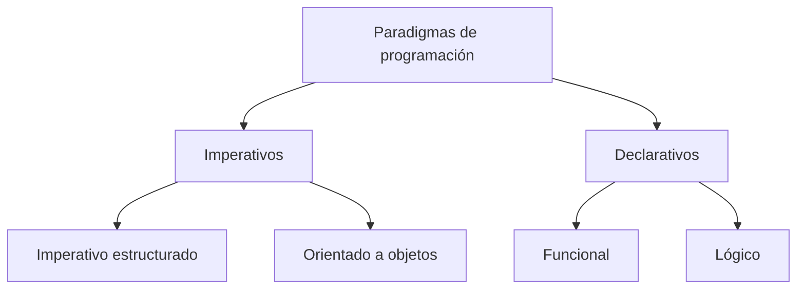

# Datos del estudiante

| Campo | Información |
|---|---|
| **Nombre completo** | Cota Hernandez Christian Armando |
| **Número de control** | 23211941 |
| **Carrera** | Ingeniería en Sistemas Computacionales |
| **Grupo** | SC7C |
| **Materia** | Programación Lógica y Funcional |
| **Profesor** | Rene Solis Reyes |
| **Tema** | ¿Qué es un paradigma de programación? Imperativo, orientado a objetos, funcional y lógico |

# ¿Qué es un paradigma de programación? Imperativo, orientado a objetos, funcional y lógico

<p align="center">
  
  
</p>

<p align="center"><em>Una introducción a las distintas formas de pensar la computación: imperativo, orientado a objetos, funcional y lógico.</em></p>

## Tabla de contenidos

- [1. Introducción](#1-introducción)
- [2. ¿Qué es un paradigma de programación?](#2-qué-es-un-paradigma-de-programación)
- [3. Paradigma imperativo](#3-paradigma-imperativo)
- [4. Paradigma orientado a objetos](#4-paradigma-orientado-a-objetos)
- [5. Paradigma funcional](#5-paradigma-funcional)
- [6. Paradigma lógico](#6-paradigma-lógico)
- [7. Comparación entre paradigmas](#7-comparación-entre-paradigmas)
- [8. Lenguajes multiparadigma](#8-lenguajes-multiparadigma)
- [9. Aplicaciones y relevancia práctica](#9-aplicaciones-y-relevancia-práctica)
- [10. Conclusiones](#10-conclusiones)
- [11. Bibliografía](#11-bibliografía)

## 1. Introducción

Cuando una persona empieza a programar suele pensar que la única forma de resolver un problema es escribir una lista de pasos que la computadora ejecuta en orden, uno tras otro. Esa intuición corresponde apenas a uno de varios **paradigmas de programación** que existen, es decir, a una de varias maneras distintas de concebir qué significa "computar" y de organizar cómo se estructura una solución.

Un paradigma no es un lenguaje: es el conjunto de principios, conceptos y forma de pensar que un lenguaje favorece o incluso impone. Un mismo lenguaje puede además soportar varios paradigmas a la vez (multiparadigma), como ocurre con Python, Scala o JavaScript. Comprender los distintos paradigmas permite elegir mejores herramientas para cada problema y entender por qué lenguajes tan distintos como C, Java, Haskell o Prolog toman decisiones de diseño tan diferentes entre sí.

El término "paradigma" en este contexto fue popularizado por Robert W. Floyd en su conferencia del Premio Turing de 1978, *"The Paradigms of Programming"*, publicada en 1979 en *Communications of the ACM*. Floyd tomó prestada la idea de Thomas Kuhn —quien usaba "paradigma" para describir los marcos conceptuales que dominan una disciplina científica en un momento dado— y la aplicó a la programación para argumentar que enseñar solo la sintaxis de un lenguaje no basta: también hay que enseñar las estrategias de diseño y de pensamiento que hay detrás de un buen programa.

Este documento presenta una investigación introductoria sobre cuatro paradigmas centrales para el curso: **imperativo, orientado a objetos, funcional y lógico**, con énfasis en cómo cada uno concibe el problema de "resolver algo" con una computadora.

## 2. ¿Qué es un paradigma de programación?

Un paradigma de programación es un modelo o enfoque para estructurar la solución de un problema computacional. Define qué se considera una "unidad" de programa (una instrucción, un objeto, una función o una regla lógica), cómo se representa y se transforma el estado, y qué mecanismos de control existen para avanzar en la ejecución.

| Elemento | Descripción |
|---|---|
| Unidad básica | Instrucción, objeto, función o regla lógica, según el paradigma |
| Estado | Mutable y explícito, o inmutable/implícito, según el paradigma |
| Pregunta central | *¿Cómo* se resuelve? o *¿qué* se quiere obtener? |
| Ejemplo de lenguaje | C, Java, Haskell, Prolog |

Los paradigmas suelen agruparse en dos grandes familias:

- **Imperativos:** describen el *cómo* mediante instrucciones que modifican un estado (incluye el paradigma imperativo puro y el orientado a objetos).
- **Declarativos:** describen el *qué* sin especificar el flujo de control paso a paso (incluye el paradigma funcional y el lógico).



## 3. Paradigma imperativo

El paradigma imperativo es históricamente el más antiguo y el más cercano a cómo funciona una computadora por dentro: una máquina de von Neumann ejecuta instrucciones secuenciales que modifican un estado guardado en memoria. Programar de forma imperativa significa describir **cómo** resolver un problema: se declaran variables, se les asigna y reasigna valores, y se usan estructuras de control como condicionales y ciclos (`for`, `while`) para dirigir el flujo de ejecución paso a paso.

```c
#include <stdio.h>

int main(void) {
    int total = 0;
    for (int i = 1; i <= 10; i++) {
        total = total + i;
    }
    printf("Suma: %d\n", total);
    return 0;
}
```

Este programa, escrito en C, calcula la suma de los números del 1 al 10 modificando repetidamente la variable `total`. Cada línea representa una instrucción que cambia el estado del programa.

Lenguajes como C, Pascal o el BASIC clásico son representantes directos de este paradigma. Su principal ventaja es que refleja de manera casi literal el modelo de ejecución del hardware, lo que facilita razonar sobre el rendimiento; su principal riesgo es que, al depender de un estado mutable compartido, los programas grandes se vuelven difíciles de verificar y propensos a efectos secundarios inesperados.

## 4. Paradigma orientado a objetos

La programación orientada a objetos (POO) es, en la práctica, una evolución del paradigma imperativo: sigue habiendo estado mutable y secuencias de instrucciones, pero ese estado se encapsula dentro de **objetos**, instancias de **clases** que agrupan datos (atributos) y comportamiento (métodos) relacionados.

| Pilar | Descripción |
|---|---|
| Encapsulamiento | Los datos y el comportamiento se agrupan y se protegen dentro del objeto |
| Herencia | Una clase puede reutilizar y extender el comportamiento de otra |
| Polimorfismo | Distintos objetos pueden responder de forma distinta al mismo mensaje |
| Abstracción | Se modelan entidades del mundo real ocultando detalles internos |

```java
class Vehiculo {
    protected String nombre;

    Vehiculo(String nombre) {
        this.nombre = nombre;
    }

    String describir() {
        return "Vehículo: " + nombre;
    }
}

class Auto extends Vehiculo {
    Auto(String nombre) {
        super(nombre);
    }

    @Override
    String describir() {
        return "Auto: " + nombre;
    }
}

public class Main {
    public static void main(String[] args) {
        Vehiculo v = new Auto("Sedán");
        System.out.println(v.describir());
    }
}
```

En vez de operar sobre variables sueltas, el programador diseña "entidades" que interactúan enviándose mensajes (llamadas a métodos) entre sí. Java, C++, C# y Python (que también admite otros paradigmas) son ejemplos habituales. La POO facilita modelar dominios del mundo real y reutilizar código mediante jerarquías de clases, aunque un diseño de herencia mal planeado puede generar acoplamientos rígidos entre componentes.

## 5. Paradigma funcional

El paradigma funcional pertenece, junto con el lógico, a la familia más amplia de la **programación declarativa**: en vez de especificar una secuencia de pasos que cambian un estado, se describe **qué** resultado se quiere obtener, expresado como evaluación de funciones matemáticas.

| Concepto | Descripción |
|---|---|
| Función pura | No tiene efectos secundarios; su salida depende solo de su entrada |
| Inmutabilidad | Los datos no se modifican; se crean nuevas versiones |
| Función de primera clase | Una función puede pasarse y devolverse como cualquier otro valor |
| Recursión | Sustituye a los bucles como mecanismo de repetición |

```haskell
sumar :: [Int] -> Int
sumar [] = 0
sumar (x:xs) = x + sumar xs

main :: IO ()
main = print (sumar [1..10])
```

En este ejemplo escrito en Haskell no se modifica ninguna variable: la función `sumar` se define recursivamente sobre la estructura de la lista (caso base `[]` y caso recursivo `x:xs`). Haskell es el ejemplo más purista del paradigma; Erlang, Elixir, Clojure, OCaml y Scala combinan estas ideas con otros paradigmas. Este enfoque facilita razonar y probar el código, y encaja de forma natural con la concurrencia, precisamente porque evita el estado compartido mutable que complica a los otros paradigmas.

## 6. Paradigma lógico

El paradigma lógico también es declarativo, pero en lugar de definir funciones, el programador declara **hechos** y **reglas** sobre un dominio, y deja que un motor de inferencia determine si una consulta puede deducirse lógicamente de esa base de conocimiento, usando mecanismos como la unificación y el retroceso (*backtracking*).

```prolog
padre(juan, maria).
padre(juan, pedro).

hermano(X, Y) :- padre(P, X), padre(P, Y), X \= Y.

?- hermano(maria, pedro).
```

En este ejemplo escrito en Prolog se declaran dos hechos (`juan` es padre de `maria` y de `pedro`) y una regla (dos personas son hermanas si comparten el mismo padre). La consulta final le pide al motor de inferencia que verifique si `maria` y `pedro` son hermanos, sin que el programador especifique el algoritmo de búsqueda.

Prolog es el representante clásico de este paradigma; Datalog y ASP (*Answer Set Programming*) son variantes usadas en bases de datos e inteligencia artificial simbólica. Este paradigma resulta especialmente útil en problemas de búsqueda, sistemas expertos y procesamiento de lenguaje natural, aunque su curva de aprendizaje es alta para quienes vienen de un fondo imperativo.

## 7. Comparación entre paradigmas

| Paradigma | Pregunta central | Estado | Unidad de trabajo | Lenguajes representativos |
|---|---|---|---|---|
| Imperativo | ¿Cómo se hace, paso a paso? | Mutable y explícito | Instrucción | C, Pascal |
| Orientado a objetos | ¿Qué entidades interactúan? | Mutable, encapsulado | Objeto | Java, C++, C# |
| Funcional | ¿Qué resultado se calcula? | Inmutable | Función | Haskell, Erlang, Elixir |
| Lógico | ¿Qué relaciones son verdaderas? | Base de hechos y reglas | Regla/consulta | Prolog, Datalog |

La diferencia más importante entre los cuatro no es cosmética sino conceptual: imperativo y orientado a objetos describen *cómo* llegar a la solución mediante instrucciones y estado mutable, mientras que funcional y lógico describen *qué* es la solución, dejando el "cómo" al motor de ejecución del lenguaje.

## 8. Lenguajes multiparadigma

En la práctica profesional actual rara vez se usa un paradigma "puro": la mayoría de los proyectos combinan enfoques según la necesidad. Python, Scala y JavaScript son ejemplos de lenguajes que admiten estilos imperativo, orientado a objetos y funcional dentro del mismo programa; Scala, además, se apoya fuertemente en ideas funcionales sobre la máquina virtual de Java.

```python
numeros = [1, 2, 3, 4, 5]

# Estilo imperativo
total = 0
for n in numeros:
    total += n

# Estilo funcional
total_funcional = sum(map(lambda x: x, numeros))

print(total, total_funcional)
```

Este ejemplo en Python resuelve el mismo problema (sumar una lista) con dos estilos distintos dentro del mismo lenguaje, lo cual ilustra por qué la clasificación en paradigmas no es excluyente sino una herramienta para entender el diseño de un programa.

## 9. Aplicaciones y relevancia práctica

- **Backends empresariales:** suelen combinar POO para modelar entidades de negocio con `streams` o colecciones funcionales para transformar datos.
- **Sistemas concurrentes y de alta disponibilidad:** aprovechan la inmutabilidad del paradigma funcional (Erlang/OTP, Elixir) para evitar condiciones de carrera.
- **Motores de reglas de negocio y sistemas expertos:** se inspiran en el paradigma lógico para expresar políticas como hechos y reglas verificables.
- **Programación de bajo nivel y sistemas embebidos:** dependen del paradigma imperativo por su cercanía al hardware y su control explícito de memoria.
- **Consultas a bases de datos:** SQL es un ejemplo cotidiano de estilo declarativo, cercano en espíritu al paradigma lógico.

## 10. Conclusiones

Un paradigma de programación es, ante todo, una forma de pensar la computación, no una característica accesoria de un lenguaje. El paradigma imperativo y su evolución orientada a objetos organizan la solución alrededor de instrucciones y estado mutable; los paradigmas funcional y lógico, de corte declarativo, la organizan alrededor de expresiones matemáticas y de relaciones lógicas respectivamente.

Ningún paradigma es superior en abstracto: cada uno ofrece ventajas distintas según el tipo de problema (rendimiento y control fino, modelado de entidades, concurrencia segura, o búsqueda y deducción). Para este curso, entender esta clasificación es la base indispensable antes de profundizar en los conceptos específicos de la programación funcional —funciones puras, inmutabilidad, recursión y coincidencia de patrones— que se abordarán en los siguientes temas del Bloque 1.

## 11. Bibliografía

[1] R. W. Floyd, "The paradigms of programming," *Communications of the ACM*, vol. 22, no. 8, pp. 455–460, Aug. 1979.

[2] P. Van Roy and S. Haridi, *Concepts, Techniques, and Models of Computer Programming*. Cambridge, MA, USA: MIT Press, 2004.

[3] H. Abelson, G. J. Sussman, and J. Sussman, *Structure and Interpretation of Computer Programs*, 2nd ed. Cambridge, MA, USA: MIT Press, 1996.

[4] "Paradigma de programación," *Wikipedia, la enciclopedia libre*. [En línea]. Disponible en: https://es.wikipedia.org/wiki/Paradigma_de_programaci%C3%B3n. [Accedido: 1-sep-2026].

[5] M. Gabbrielli and S. Martini, *Programming Languages: Principles and Paradigms*, 2nd ed. London, U.K.: Springer, 2023.

[6] TripleTen México, "¿Qué son los paradigmas de programación?," *TripleTen Blog*. [En línea]. Disponible en: https://tripleten.mx/blog/que-son-los-paradigmas-de-programacion/. [Accedido: 1-sep-2026].

> El uso de inteligencia artificial para organizar, explicar o revisar este documento se encuentra documentado en el archivo [`anexo.md`](anexo.md).
